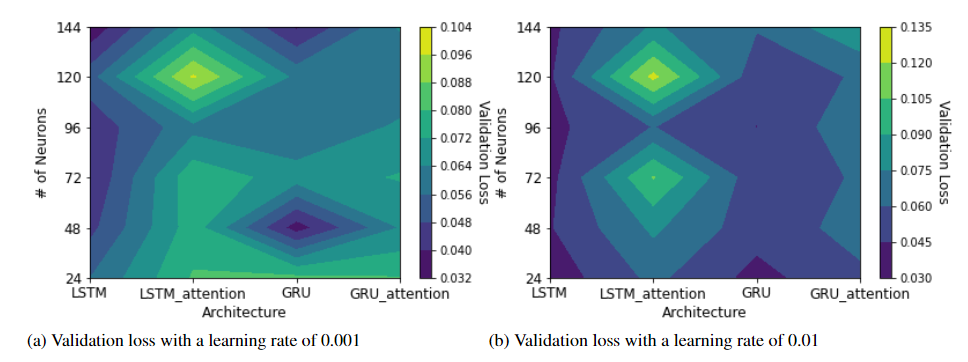
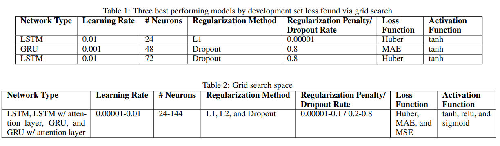
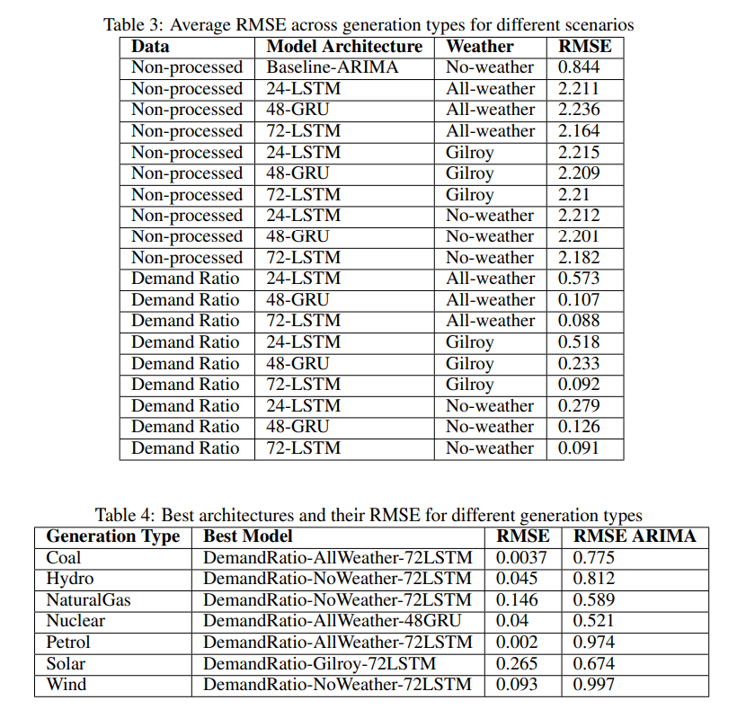
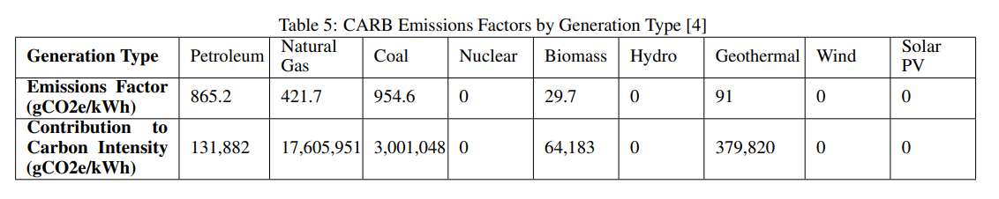
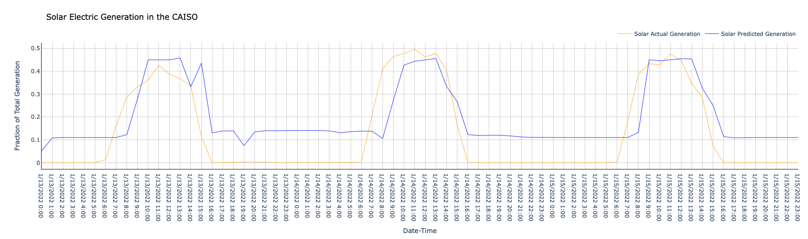
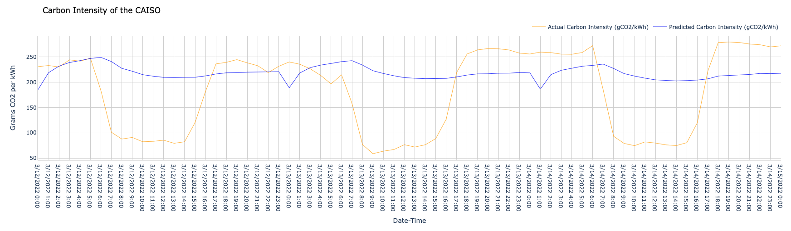
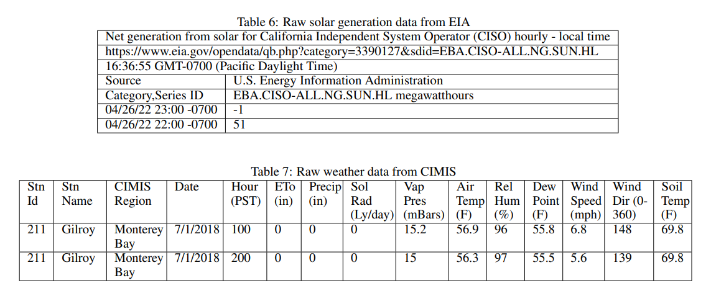

# Predicting Daily Generation Mix of the California Electric Grid to Estimate Greenhouse Gas Emissions Using Recurrent Neural Networks

Fletcher Chapin `fchapin@stanford.edu`, Jack Kessler `jwkess@stanford.edu`, Kopal Nihar `nkopal118@stanford.edu`

## Abstract
Accurate forecasts for electricity demand and associated greenhouse gas emissions can help inform the operation of electric grids, resource planning for utilities, and consequently strategies for demand response. Understanding the generation mix of the electric grid at a region level and resulting GHG emissions is increasingly important in light of climate change, as the predictions will be used by grid operators and policymakers to take effective actions. In this project, we trained a separate model for each generation type in the California grid that predicts proportion of total demand one day in advance using electric grid and weather data. We then use the predicted fractional generation mix to estimate GHG emissions. Our results indicate that deep learning based approaches can be used effectively to predict the generation mixes of the grid, especially in comparison to simple time series based machine learning approaches, like ARIMA. Despite our individual models performing better than ARIMA, the compounding forecasting errors of each separate generation type led to some inaccuracies in GHG emission prediction.

## Problem Description
It's well established that elevated greenhouse gas (GHG) concentrations in the atmosphere, such as CO$_2$,  are trapping heat and accelerating climate change [1]. After transportation, electrical generation is the second-largest contributor to GHG emissions in the United States [2]. Since most of the emissions related to electricity come from combusting coal and natural gas, understanding the electricity generation mix is the key component of predicting GHG emissions.

For both grid operators and policy makers, predicting GHG emissions on short timescales can be quite useful. For example, understanding when emissions will be highest would facilitate demand response, i.e. load shedding and shifting to reduce this emissions peak. Additionally, many municipalities use time-of-use (TOU) pricing to incentivize consumers to shift usage away from peak periods. However, real-time pricing (RTP) has been found to be far more effective at reducing GHG emissions than TOU [3]. High fidelity, high frequency emissions forecasts could be used to determine RTP rates.

In this project, we predict fractional generation mixes in the California grid one day in advance using a recurrent neural network (RNN) trained on electricity and meteorological data. Finally, we combine those fractional generation mixes with emissions factors to estimate the GHG emissions due to electricity generation [4].

## Related Work
Due to the importance of accurately predicting greenhouse gas emissions from electrical generation, there have been numerous recent studies in the area. Earlier work employed non-ML techniques, like regressing sub-regional emissions from known regional-level emissions [5]. More recent analyses have compared various methods to find that deep learning approaches achieved the most accurate prediction [6], [7], [8]. While employing an Autoregressive Integrated Moving Average (ARIMA) model, Leerbeck et al. found that LASSO regularization was key to reducing overfitting, selecting 30 predictors from a possible 473 [9]. In a recent review article, Lipu et al. found that hybrid models, i.e. an ML model incorporating physical models (like solar radiation or wind speed) improved the accuracy of renewable energy generation predictions [10].

## Dataset
We collected hourly electricity operating data, including actual demand, net generation, and generation mix of the grid for 2018 to 2022 from Energy Information Administration (EIA) Open Data Platform [11]. Weather data is especially important to renewable energy prediction [10], so we augmented the EIA data with temperature, wind speed, and precipitation, solar radiation, and other data over the same time period from CIMIS [12]. Sample data entries are available in the Appendix. We used the first 3 years as training data and the last year was split in half for development and testing.

The code used to merge the data files can be found in `parse_data.ipynb`. Each EIA data point was a separate CSV file, so the code first concatenates all the separate files into a single array with each feature as a column. It then loops through each weather data file (one per weather station) and unpacks the available features, prepending the station name to the column name. One challenge was converting between timezones, as EIA data was in UTC and CIMIS data in PST.

Since greenhouse gas emissions per kilowatt hour is dependent only on the proportion of each generation type, we created a "Demand Ratio" version of the EIA dataset which divided each column by the total grid demand before dropping the demand column. We compared the performance of the model using this version of the data to the performance of the model with raw data. To deal with missing entries, an additional pre-processing step of replacing null values with zero was undergone, as recommended for LSTMs [14].

## Methods
We explore recurrent neural networks to minimize the forecast error while training our models after pre-processing, cleaning and standardizing the dataset. RNNs are designed to recognize patterns in sequences of data, such as time series. The recurrent layer in simple RNN optimizes three parameters: weight for input, weight for hidden layer and bias based on a modified version of backpropagation which includes the unfolding of time to train the weights. We also explored some specific RNNs such as Long Short Term Memory (LSTM) and Gated Recurrent Unit (GRU) to learn long-term dependencies. Finally, we selected the best model for each generation type based on RMSE to produce an ideal "mix-and-match" model. We compared these results to AutoRegressive Integrated Moving Average (ARIMA), a common modeling approach for time series data, as a baseline.

### Grid Search
We used a grid search to select the best model architecture and hyperparameters. To limit the search space, the search was performed in 3 batches. First, we investigated learning rate, number of neurons per layer, and model type (see Figure 1). We then selected the three best models from that batch according to development set loss before tuning their regularization method and penalty. Finally, we chose the loss and activation functions for these three models. Table 1 shows the 3 best performing models found via grid search. The full search space can be found in Table 2. During exploratory analysis we investigated adding more layers to the network, but in all cases that led to worse results on the development set due to overfitting.

Figure 1: Architecture grid search results

### Model Training and Selection
Once the grid search was complete, we trained the three best performing models on each of the 8 generation types. For each model, we tried 3 sets of weather data: 1) no weather data; 2) weather data from a single station (Gilroy, as it is centrally located); and 3) weather data from 6 stations located close to renewable generation sites ("All Weather"). We also experimented with "Demand Ratio" EIA data vs. unprocessed EIA data, for a total of 144 trained models (3 models x 8 generation types x 3 weather datasets x 2 EIA datasets).

## Results

### Generation Prediction
For each of the 144 trained models, we predicted on the test dataset and evaluated using RMSE. Table 3 shows the results when averaging across generation types for every combination of architecture, weather data, and electricity data. Referring to Table 3, we can observe that "Demand Ratio" data with 72-LSTM architecture is common for the best models. Our "mix-and-match" model, which was created by selecting the best architecture and input data for each generation type, outperforms an ARIMA model trained for each generation type as depicted in Table 4.

Predicted versus actual solar generation for 72 hours in March 2022 may be seen in Figure 2. Whether or not meteorological was beneficial depended on generation type. For example, solar radiation required weather data due to the diurnal pattern of the sun, while natural gas predictions were most accurate with no weather data (likely because superfluous data led to overfitting).

### Emissions Prediction
To simulate a real-world deployment scenario for our best performing "mix-and-match" model, we converted generation predictions into carbon emissions predictions. Specifically, we predict carbon emissions on a per kilowatt-hour (kWh) basis. Once the fractional grid generation mix was predicted, the California Air Resources Board (CARB) emissions factors were then used to determine the resulting grams of CO2 emitted per kilowatt-hour of electricity consumed at a certain point in time. The CARB emissions factors may be seen in Table 5.

Through the use of these emissions factors, and the predictions for each generation type, the algorithm was able to output a predicted grid emissions intensity. Predicted versus actual carbon intensity for 72 hours in March 2022 may be seen in Figure 3. The algorithm was able to learn a slight undulating pattern of carbon intensity, but does not correctly predict low enough carbon intensities in the middle of the day. It appears that this issue likely resulted from compounding errors of the different models. I.e., even if one model performs rather well in isolation, at any given time one of the eight models is likely to have an error which skews the final emissions prediction.

Figure 2: Predicted versus actual solar generation for 3 days in March 2022

In particular, one should note the error associated with the best natural gas model, i.e., DemandRatio-NoWeather-72LSTM. Compared to the other models, this model has the second highest RMSE value of 0.146. Furthermore, this form of power generation has the highest actual contribution to grid emissions according to CARB because it is used more often than other fossil fuels. Therefore, the natural gas model is the largest source of error in the final carbon emissions predictions.

Figure 3: Predicted versus actual carbon emission intensity for 3 days in March 2022

## Conclusion & Future Work
In this project, we predicted generation mixes in the California grid one day in advance using a recurrent neural network (RNN) trained on electricity and meteorological data. We then combined those predictions with emissions factors to estimate the GHG emissions due to electricity generation. We used RMSE to evaluate RNN models against ARIMA models and found that RNNs outperform ARIMA by a significant margin. Specifically, electricity generation mix data normalized by total demand combined with a 72 unit LSTM architecture performed the best. Since natural gas is the largest contributor to emissions prediction error, future improvements to our models should focus on just that generation type. If given more time and resources, we would have liked to perform a more comprehensive grid search to explore more model architectures and parameters. We would have also applied our models to predict generation mixes outside California.

## Contributions
Kopal Nihar formulated and applied the "Demand Ratio" method, built the baseline ARIMA models, and conducted RMSE analysis to determine the "mix-and-match" model. Jack Kessler collected EIA data, predicted emissions using CARB emissions factors, and plotted predictions. Fletcher Chapin collected CIMIS data, developed and executed the grid search, and trained the models. All group members helped to conduct exploratory analysis, review literature, and draft the report.

## References
[1] NASA. (2022, March 15). Carbon Dioxide. Retrieved April 9, 2022, from https://climate.nasa.gov/vital-signs/carbon-dioxide/

[2] EPA. (2021, July 27). Sources of Greenhouse Gas Emissions. Retrieved April 9, 2022 from https://www.epa.gov/ghgemissions/sources-greenhouse-gas-emissions

[3] Spees, K. \& Lave, L. (2008). Impacts of Responsive Load in PJM: Load Shifting and Real Time Pricing. *The Energy Journal, 29*(2), 101-121. http://dx.doi.org/10.5547/ISSN0195-6574-EJ-Vol29-No2-6

[4] California Air Resources Board (2020, January 8). Low Carbon Fuel Standard. Retrieved April 27, 2022 from https://ww2.arb.ca.gov/sites/default/files/classic/fuels/lcfs/fuelpathways/comments/tier2/elec\_update.pdf

[5] Zivin, J.S.G., Kotchen, M.J., \& Mansur, E.T. (2014). Spatial and temporal heterogeneity of marginal emissions: Implications for electric cars and other electricity-shifting policies. *Journal of Economic Behavior \& Organization, 107*, 248-268. https://doi.org/10.1016/j.jebo.2014.03.010

[6] Bakay, M.S. \& Ağbulut, Ü. (2021). Electricity production based forecasting of greenhouse gas emissions in Turkey with deep learning, support vector machine and artificial neural network. *Journal of Cleaner Production, 285,* 125324. https://doi.org/10.1016/j.jclepro.2020.125324

[7] Shirzadi, N., Nizami, A., Khazen, M., \& Nik-Bakht, M. (2021). Medium-Term Regional Electricity Load Forecasting through Machine Learning and Deep Learning. *Designs, 5*(2), 27. https://doi.org/10.3390/designs5020027

[8] Qader, M.R., Khan, S., Kamal, M., Usman, M., \& M. (2022). Forecasting carbon emissions due to electricity power generation in Bahrain. *Environmental Science and Pollution Research, 29,* 17346–17357.  https://doi.org/10.1007/s11356-021-16960-2

[9] Leerbeck, K., Bacher, P., Junker, R.G., Goranović, G., Corradi, O., Ebrahimy, R., Tveit, A., \& Madsen, H. (2020). Short term forecasting of CO$_2$ emission intensity in power grids by machine learning. *Applied Energy, 277,* 115527. https://doi.org/10.1016/j.apenergy.2020.115527

[10] Lipu, M.S.H., Miah, M.S., Ansari, S., Hannan, M.A., Hasan, K., Sarker, M.R., Mahmud, M.S., Hussain, A., \& Mansor, M. (2021). Data-driven hybrid approaches for renewable power prediction toward grid decarbonization: Applications, issues and suggestions. *Journal of Cleaner Production, 328,* 129476. https://doi.org/10.1016/j.jclepro.2021.129476

[11] Energy Information Administration. (2022, February 12). Open Data. Retrieved April 12, 2022, from https://www.eia.gov/opendata/

[12] California Department of Water Resources. (2022, May 3). California Irrigation Management Information System. Retrieved May 11, 2022 from https://cimis.water.ca.gov/

[13] Attri, P., Sharma, Y., Takach, K., \& Shah, F. (2020, July 20). *Timeseries forecasting for weather prediction*. Keras. Retrieved May 7, 2022 from https://keras.io/examples/timeseries/timeseries\_weather\_forecasting/

[14] Chollet, F. (2021). *Deep Learning with Python*. Manning Publications.

[15] Dobilas, S. (2022, January 23). *RNN: Recurrent Neural Networks — How to Successfully Model Sequential Data in Python.* Medium. Retrieved May 11, 2022 from https://towardsdatascience.com/rnn-recurrent-neural-networks-how-to-successfully-model-sequential-data-in-python-5a0b9e494f92

## Appendix

